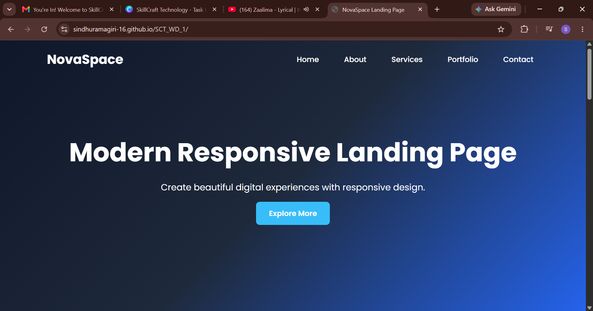
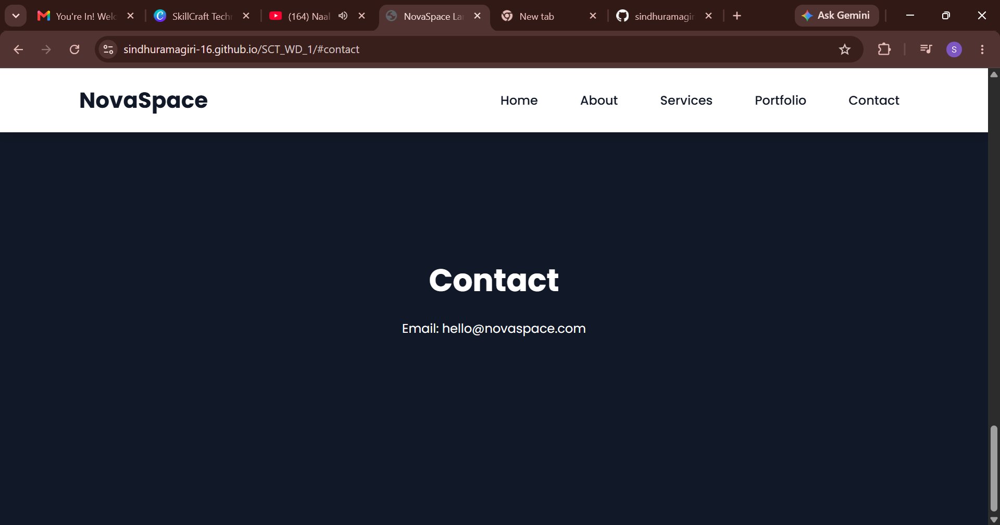
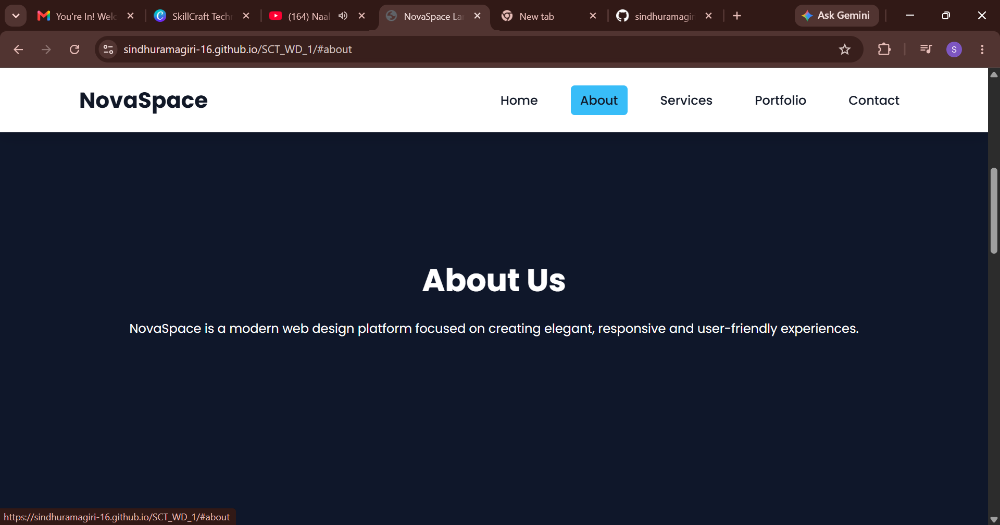

# Responsive Landing Page

## Task 01 - Interactive Navigation Menu

### Features

- Fixed Navigation Bar
- Navigation Color Changes on Scroll
- Hover Effects on Menu Items
- Smooth Scrolling
- Fully Responsive Design
- Mobile Navigation Menu
- Modern Landing Page UI

### Technologies Used

- HTML5
- CSS3
- JavaScript
  ## Screenshots

## Screenshots

### Home Page

### Features Section

### Services Section

### Mobile View

### How to Run

1. Download the project.
2. Open in VS Code.
3. Run index.html using Live Server.

### Author

Created for Internship Task Submission.
